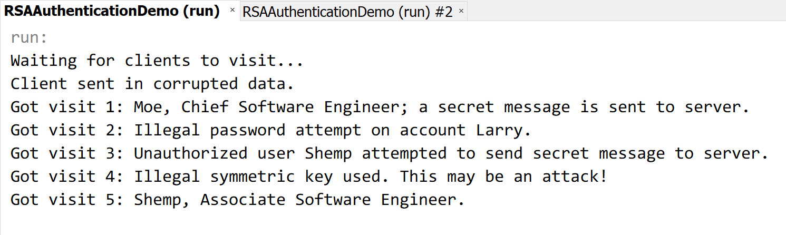
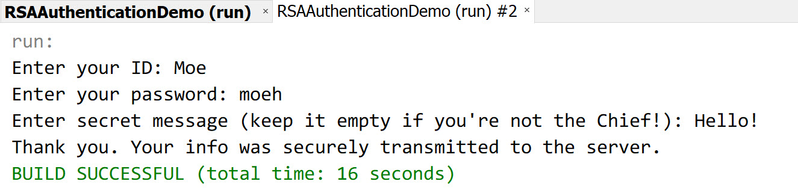
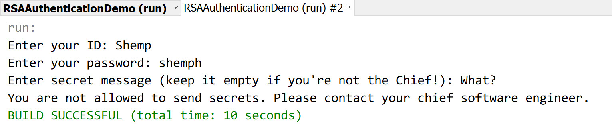
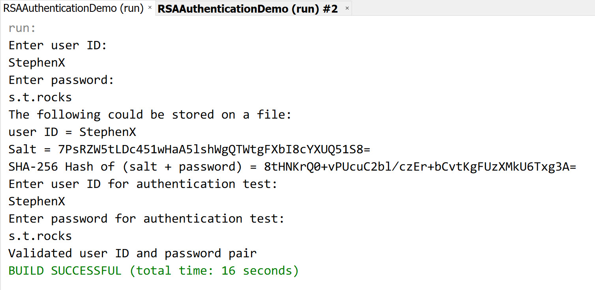

# Server-Client Authentication System Demo Over TCP With RSA and TEA Encryption
**Author:** Stephen Tse \<***@cmu.edu\>  
**Project Version:** 1.0.0

A demonstration of a server-client authentication system over TCP using [RSA](https://en.wikipedia.org/wiki/RSA_(cryptosystem)) (asymmetric) and [TEA](https://en.wikipedia.org/wiki/Tiny_Encryption_Algorithm) (symmetric) encryption. Note that the code may not be suitable to be put directly to production use. See key implementation notes below for some details.

To test run the project, import the project into [NetBeans](https://netbeans.org/features/index.html) then run respective program files: `Server`, `Client` or `PasswordHash` if you'd like to generate password salts and hashes for new accounts to be put to server. Note that you should run `Server` before `Client`.


## Screenshots
* Server:

    

* Client:

    
    

* PasswordHash:

    


## Key Implementation Notes

* TEA is used to encrypt data passed from client to server. Since it is one of the fastest and most efficient symmetric cryptographic algorithms, it makes sense to use it over RSA to encrypt the main data stream for performance concerns (asymmetric encryption takes time and resources!). In reality, it's recommended to use [XTEA](https://en.wikipedia.org/wiki/XTEA) instead as it corrects several weaknesses of TEA. Also, consider using other symmetric algorithms if you need more than 16-byte (128-bit) keys.

* The client side automatically generates a temporary TEA key for each communication session using `SecureRandom` (by default it will use [`NativePRNG`](https://docs.oracle.com/javase/8/docs/technotes/guides/security/StandardNames.html#SecureRandom) that utilizes the random number generator from the underlying native OS). It will then be encrypted using server's RSA public key before being sent to the server.

* The server authenticates the TEA key by checking if all characters of the decrypted content are valid ASCII characters (since we're sending JSON strings with only ASCII characters back and forth). If invalid symmetric key is received, the server will instantly close the socket and report this anomaly in the console log (see screenshot).

* User account information is hardcoded in the server with password hashed using `SHA-256` with a random 256-bit salt generated using `SecureRandom`. In the project, the salt is simply added before the actual password before hashing; in reality you should adopt more sophisticated method.

    Information of hardcoded users:

    | User  | Password | Role                        |
    |-------|----------|-----------------------------|
    | Moe   | moeh     | Chief Software Engineer     |
    | Larry | larryh   | Associate Software Engineer |
    | Shemp | shemph   | Associate Software Engineer |

    Only Moe has the authority to post secret message to the server. This limit is set just to demonstrate a simple user permission system.

* This project serves only as a demonstration of the encryption process and one of its possible use cases. It's not optimized for use cases in reality. For instance, the server doesn't really support concurrent access: it will mess up the console log when multiple users connect to the server at the same time.


## Generate your own RSA keys!

You may generate your own RSA keys using the `keytool` command-line tool from Java SE.

To generate a keystore that contains the private key:

```
keytool -genkey -alias [your_key_alias] -keyalg RSA -keystore [your_keystore_name].jks
```

To generate an X509 certificate that contains the public key:

```
keytool -export -alias [your_key_alias] -keystore [your_keystore_name].jks -file [your_cert_name].cer
```

Optionally, you may place the certificate into the truststore of the client side to trust it:

```
keytool -import -alias [your_key_alias] -keystore [your_key_alias].truststore -file [your_cert_name].cer
```

Refer to the code for details of using the generated keys.
